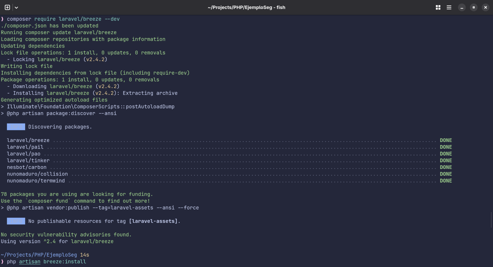
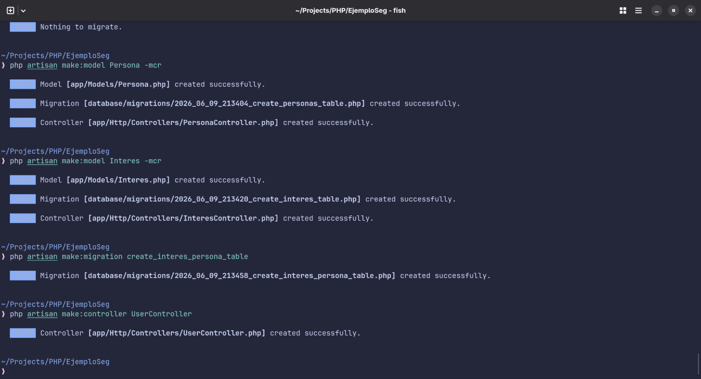
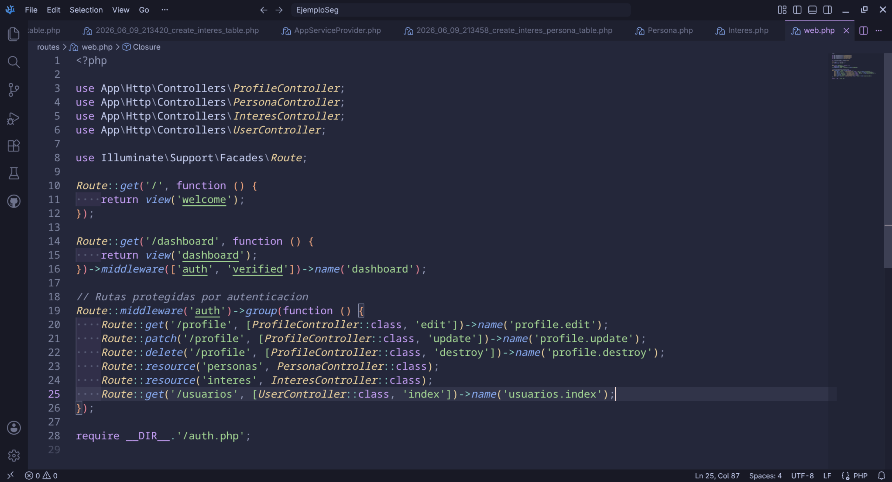
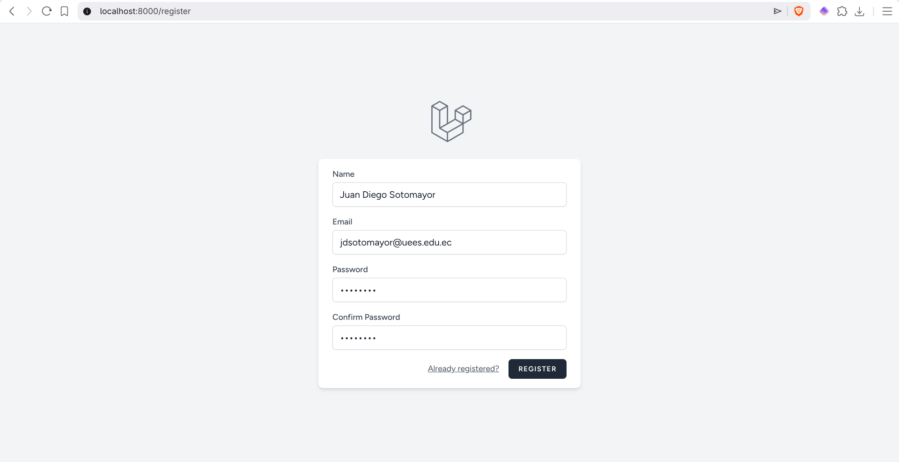
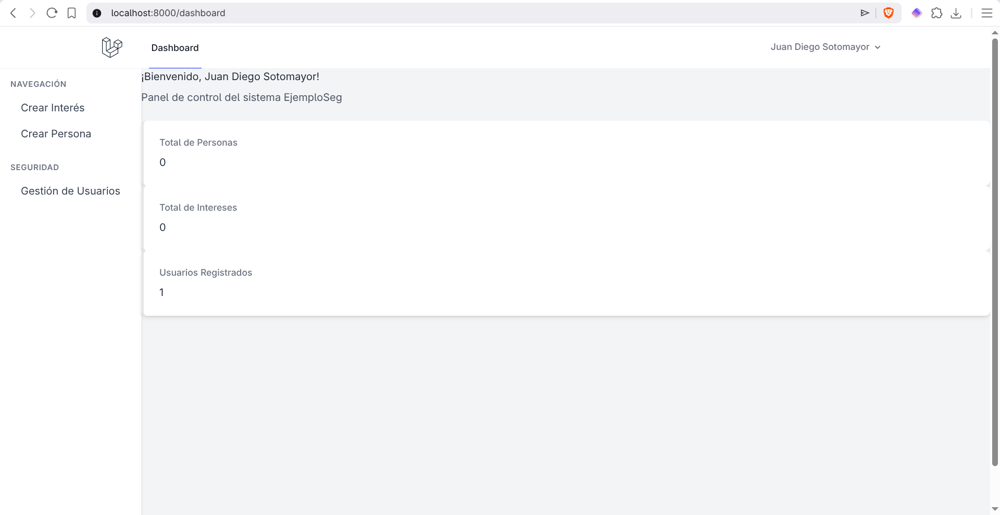
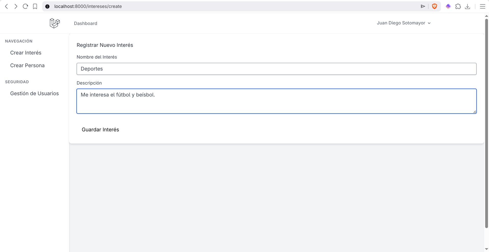

# Taller 7 - Laravel Breeze, relaciones muchos a muchos y dashboard

## Objetivo

Desarrollar una aplicación en Laravel con autenticación mediante Laravel Breeze, conexión a MariaDB con XAMPP y manejo de una relación muchos a muchos entre personas e intereses.

El sistema permite registrar usuarios, iniciar sesión y crear intereses en un dashboard protegido.


---

## Capturas de evidencia

### Captura 1 — Instalación de Laravel Breeze



Se muestra la instalación de Laravel Breeze y la generación de los archivos necesarios para el sistema de autenticación.

---

### Captura 2 — Creación de modelos, migraciones y controladores



Se crean los modelos `Persona` e `Interes`, sus migraciones, controladores y la migración pivote `interes_persona`.

---

### Captura 3 — Configuración de rutas



Se muestra el archivo `routes/web.php` con las rutas protegidas para `personas`, `intereses`, `usuarios` y `dashboard`.

---

### Captura 4 — Registro de usuario



Se muestra la pantalla de registro generada por Laravel Breeze, donde se crea un usuario del sistema.

---

### Captura 5 — Dashboard inicial



Se muestra el dashboard después de iniciar sesión, con el menú lateral y las tarjetas estadísticas.

---

### Captura 6 — Registro de interés



Se muestra el formulario para registrar un nuevo interés con nombre y descripción.

---

### Captura 7 — Dashboard actualizado


Se muestra el dashboard actualizado después de registrar un interés, evidenciando el conteo correcto de datos.

---

## Tecnologías utilizadas

| Tecnología | Uso |
|---|---|
| Laravel 13 | Framework principal del proyecto. |
| PHP | Lenguaje base de la aplicación. |
| Composer | Instalación de dependencias PHP. |
| Laravel Breeze | Autenticación de usuarios. |
| MariaDB | Base de datos del proyecto. |
| XAMPP | Entorno local para MariaDB y phpMyAdmin. |
| Blade | Motor de plantillas de Laravel. |
| Tailwind CSS | Estilos de la interfaz. |
| Vite | Compilación de assets. |
| Artisan | Comandos de Laravel. |

---

## Archivos principales

| Archivo | Función |
|---|---|
| `app/Models/Persona.php` | Modelo de personas. |
| `app/Models/Interes.php` | Modelo de intereses. |
| `app/Http/Controllers/PersonaController.php` | Controlador para registrar personas. |
| `app/Http/Controllers/InteresController.php` | Controlador para registrar intereses. |
| `app/Http/Controllers/UserController.php` | Controlador para listar usuarios. |
| `app/Http/Controllers/DashboardController.php` | Controlador de estadísticas del dashboard. |
| `resources/views/layouts/plantilla.blade.php` | Plantilla principal. |
| `resources/views/layouts/sidebar.blade.php` | Menú lateral. |
| `resources/views/personas/create.blade.php` | Vista para crear personas. |
| `resources/views/intereses/create.blade.php` | Vista para crear intereses. |
| `resources/views/usuarios/index.blade.php` | Vista de gestión de usuarios. |
| `resources/views/dashboard.blade.php` | Vista principal del dashboard. |
| `routes/web.php` | Definición de rutas. |
| `.env` | Configuración de conexión a la base de datos. |

---

## Configuración de base de datos

En el archivo `.env` se configuró la conexión a MariaDB:

```env
DB_CONNECTION=mysql
DB_HOST=127.0.0.1
DB_PORT=3306
DB_DATABASE=ejemploseg
DB_USERNAME=root
DB_PASSWORD=
```

La base de datos `ejemploseg` debe estar creada previamente en phpMyAdmin.

---

## Migraciones principales

### Tabla `personas`

```php
Schema::create('personas', function (Blueprint $table) {
    $table->id();
    $table->string('nombre');
    $table->string('email')->unique();
    $table->timestamps();
});
```

### Tabla `intereses`

```php
Schema::create('intereses', function (Blueprint $table) {
    $table->id();
    $table->string('nombre');
    $table->string('descripcion')->nullable();
    $table->timestamps();
});
```

### Tabla pivote `interes_persona`

```php
Schema::create('interes_persona', function (Blueprint $table) {
    $table->id();

    $table->foreignId('persona_id')
        ->constrained('personas')
        ->onDelete('cascade');

    $table->foreignId('interes_id')
        ->constrained('intereses')
        ->onDelete('cascade');

    $table->timestamps();
});
```

Esta tabla permite relacionar varias personas con varios intereses.

---

## Relaciones de los modelos

### Modelo `Persona`

```php
public function intereses()
{
    return $this->belongsToMany(
        Interes::class,
        'interes_persona',
        'persona_id',
        'interes_id'
    );
}
```

### Modelo `Interes`

```php
protected $table = 'intereses';

public function personas()
{
    return $this->belongsToMany(
        Persona::class,
        'interes_persona',
        'interes_id',
        'persona_id'
    );
}
```

La propiedad `$table = 'intereses'` evita que Laravel busque una tabla llamada `interes`.

---

## Rutas principales

```php
Route::get('/dashboard', [DashboardController::class, 'index'])
    ->middleware(['auth', 'verified'])
    ->name('dashboard');

Route::middleware('auth')->group(function () {
    Route::resource('personas', PersonaController::class);
    Route::resource('intereses', InteresController::class);

    Route::get('/usuarios', [UserController::class, 'index'])
        ->name('usuarios.index');
});
```

Rutas usadas durante el taller:

```text
http://localhost:8000/register
http://localhost:8000/login
http://localhost:8000/dashboard
http://localhost:8000/intereses/create
http://localhost:8000/personas/create
http://localhost:8000/usuarios
```

---

## Funcionamiento general

El usuario se registra o inicia sesión mediante Laravel Breeze.  
Después accede al dashboard, donde se muestran los totales de personas, intereses y usuarios registrados.

Desde el menú lateral se puede crear un interés, registrar una persona y consultar la gestión de usuarios.  
Cuando se registra una persona, se pueden seleccionar intereses previamente creados, guardando la relación en la tabla pivote `interes_persona`.

---

## Controladores principales

### `DashboardController`

```php
public function index()
{
    $totalPersonas = Persona::count();
    $totalIntereses = Interes::count();
    $totalUsuarios = User::count();

    return view('dashboard', compact(
        'totalPersonas',
        'totalIntereses',
        'totalUsuarios'
    ));
}
```

### `InteresController`

```php
public function store(Request $request)
{
    $request->validate([
        'nombre' => 'required|string|max:255',
        'descripcion' => 'nullable|string',
    ]);

    Interes::create($request->all());

    return redirect()
        ->route('intereses.create')
        ->with('success', 'Interés creado exitosamente.');
}
```

### `PersonaController`

```php
public function store(Request $request)
{
    $request->validate([
        'nombre' => 'required|string|max:255',
        'email' => 'required|email|unique:personas',
        'intereses' => 'array',
    ]);

    $persona = Persona::create($request->only('nombre', 'email'));

    if ($request->has('intereses')) {
        $persona->intereses()->attach($request->intereses);
    }

    return redirect()
        ->route('personas.create')
        ->with('success', 'Persona creada exitosamente.');
}
```

---

## Ejecución del proyecto

Instalar dependencias:

```bash
composer install
npm install
```

Compilar recursos:

```bash
npm run build
```

Ejecutar migraciones:

```bash
php artisan migrate
```

Levantar el servidor:

```bash
php artisan serve
```

Abrir en el navegador:

```text
http://localhost:8000
```

---

## Autor

Juan Diego Sotomayor
